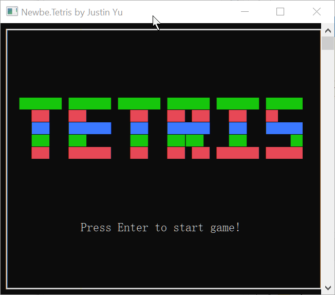
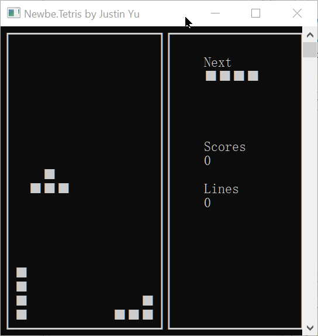
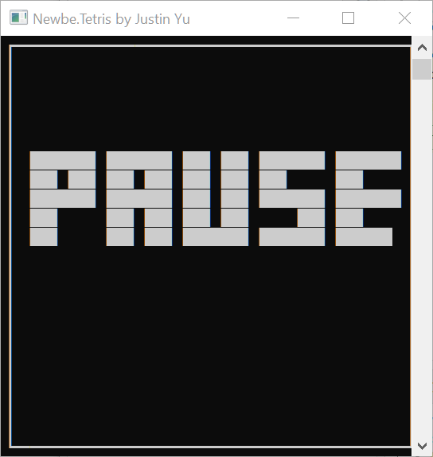

# Nebwe.Tetris

- [English](README.md)
- [简体中文](README.zh.md)

这是一款我多年前使用C语言编写的小游戏。现在，我使用 Rust 进行了全面重写，主要是为了练习使用 Rust。

C语言版本地址：<https://gitee.com/yks/Testri>

## 下载和启动

你可以通过 Release 页面下载最新的版本，解压即可启动。

## 截图

## 如何操作游戏

`Enter`:开始游戏
`ESC`:回到首页
`↓`:快速下落
`→`:方块向右移动
`←`:方块向左移动
`↑`:旋转方块
`Space`:暂停游戏